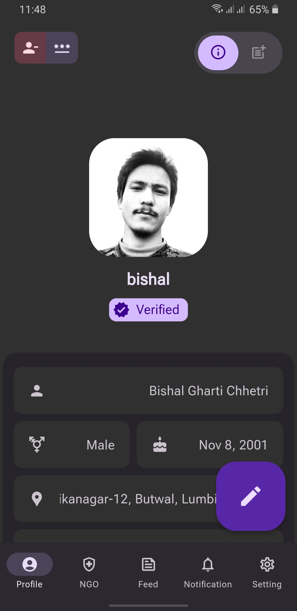
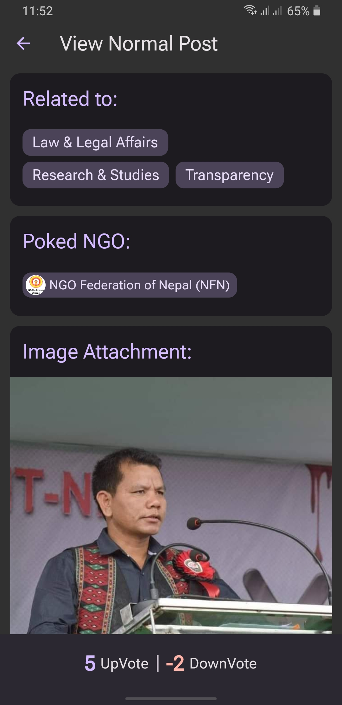

# **SASAE**

> **Server is down.**
Double-tap the **logo** on the login screen to enable **demo mode**.

 

## **Introducing our Centralized Social Impact Platform: Empowering Change Together!**

Welcome to the **Android app**, a centralized platform that brings together *social enthusiasts, NGOs*, and everyday people who are passionate about making a difference in society. Our app is designed to foster collaboration, enable seamless updates, and empower individuals to actively contribute towards positive change.

### **Key Features:**

1. Collaborative Updates: Stay connected with the latest developments, initiatives, and campaigns from *NGOs* and fellow social enthusiasts. Share updates, stories, and progress reports to *inspire* others and keep everyone informed.

2. Unified Workspace: Our platform serves as a *virtual workspace*, allowing NGOs and individuals to coordinate their efforts effortlessly. From project planning to resource allocation, this *all-in-one hub* streamlines collaboration and enhances productivity.

3. Amplify Your Voice: *Raise awareness* and champion causes that matter to you. Post updates, share impactful stories, and engage in meaningful discussions to *inspire* others and drive collective action for social change.

4. Seamless Collaboration: Connect and collaborate with like-minded individuals, *NGOs*, and experts who share your passion for making a positive impact. Pool your resources, skills, and ideas to create powerful campaigns and initiatives.

5. Real-Time Updates: Stay up-to-date with the progress and impact of ongoing projects. Receive real-time notifications on achievements, milestones, and opportunities to get involved. Witness the *tangible results* of your collective efforts.

6. Empowerment through Information: Access a wealth of knowledge and resources on social issues, sustainable practices, and innovative solutions. Stay informed through articles, research papers, and expert insights, *empowering* you to take informed action.

7. Engage and Mobilize: Initiate and participate in polls, surveys, and petitions to drive social change. *Mobilize* the community around critical issues and rally support for impactful causes that require attention and action.

8. Secure and User-Friendly: Our app prioritizes the security and privacy of its users. Enjoy a *seamless* and intuitive user interface that ensures your data is protected, allowing you to focus on what truly matters—making a difference.

Join our **Centralized Social Impact Platform** today and become part of a vibrant community of *change-makers*. Together, we can harness the power of collaboration, updates, and collective action to create a more *equitable, inclusive, and sustainable* society. **Download the app now and let's embark on this transformative journey together!** 
 
 

---
## Mobile

|  |  | |
| --- | --- | --- |
 |  | 
 |  | 
 |  | 
 |  | 
 |  | 
 |  | 
 |  | 
 | 

---
## Web

---